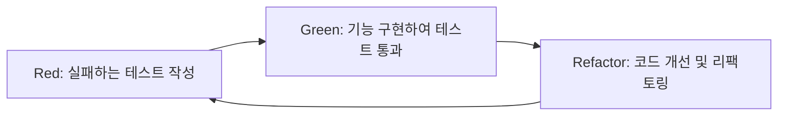

# 🗂️ 6주차 - Test & TDD
> 프로젝트에서 테스트 코드를 작성하여 기능을 안정적으로 검증하고,  
> TDD(Test-Driven Development)를 통해 오류를 최소화하는 방법을 학습합니다.

---

## 📖 이론 설명

### ✅ 테스트 필요성
- 기존 방식: 코드를 작성하고 직접 실행하여 동작 확인
- 문제점:
  - 프로젝트 규모가 커질수록 테스트 과정이 복잡해짐
  - 개발자가 모든 데이터를 직접 입력해야 함
- 해결책:
  - **테스트 코드 작성**으로 실행 없이 기능 검증 가능
  - 예외 상황과 정상 동작을 빠르게 확인 가능
  - 대규모 애플리케이션에서도 손쉽게 기능 작동 확인

---

### 🔍 테스트 종류
| 종류 | 설명 |
|------|------|
| **단위(Unit) 테스트** | 특정 모듈/계층의 기능을 개별적으로 검증 |
| **컨트롤러(Controller) 테스트** | API 요청/응답 형식, HTTP Status, 데이터 구조를 검증 |

---

### 📚 테스트 용어
- **테스트 시나리오**: 무엇을, 어떻게 테스트할지 작성 (Given-When-Then 구조)
- **테스트 케이스**: 테스트해야 할 모든 경우의 수
- **테스트 스텁**: 실제 하위 모듈 대신 동작하는 가짜 모듈

---

## 🧰 Spring Boot 테스트 환경

### 사용 라이브러리
- `JUnit5`
- `Mockito` / `mockk` (가짜 객체 생성)
- `Spring Boot Test Starter`

### 단위 테스트 예시 (Service)
- 게시글 전체 조회 → 모든 데이터 반환
- 게시글 상세 조회 → ID로 특정 게시글 조회
- 게시글 상세 조회 실패 → 잘못된 ID 시 예외 발생
- 게시글 생성 → 생성된 데이터 반환

### 컨트롤러 테스트 예시
- `MockMvc` 사용해 HTTP 요청 시뮬레이션
- `JsonPath`로 응답 데이터 검증
- **성공 시**:
  - 상태 코드: 200 또는 201
  - `status` = SUCCESS
  - `resultMsg` = "요청이 성공했습니다!"
- **실패 시**:
  - 상태 코드: 400
  - `status` = ERROR
  - Validation 메시지 포함

---

## 🔄 TDD (Test-Driven Development)
- **정의**: 테스트 코드를 먼저 작성하고, 이후 기능 구현
- **장점**:
  - 오류 최소화
  - 코드 품질 향상
- **단점**:
  - 개발 시간 증가
  - 테스트 작성 지식 필요

---

## 📊 TDD 사이클 (Red → Green → Refactor)


---

## 📌 실습

# 🗂️ Controller 테스트 시나리오 요약

Spring Boot `PostController`와 `CommentController`의 단위 테스트 함수별 시나리오를 정리한 자료입니다.  
MockMvc + Mockito를 활용하여 컨트롤러 단위에서 요청/응답과 상태 코드를 검증합니다.

---

## 1️⃣ PostControllerTest 함수별 요약

| 테스트 함수 | 설명 | 검증 포인트 | 상태 코드 |
|------------|------|-------------|-----------|
| 게시글 전체 조회 성공 | 전체 게시글 조회 | 배열 길이, 각 게시글 필드 값 | 200 OK |
| 게시글 전체 조회 - 빈 목록 | 게시글 없음 | 배열 길이 0 | 200 OK |
| 게시글 ID로 조회 성공 | 특정 게시글 조회 | BaseResponse 구조, 댓글 포함 | 200 OK |
| 게시글 작성 성공 | 게시글 작성 | 작성된 게시글 값, 댓글 배열 | 201 CREATED |
| 게시글 작성 실패 - 제목 누락 | 제목이 빈 문자열 | 유효성 검증 실패 | 400 Bad Request |
| 게시글 작성 실패 - 내용 누락 | 내용이 빈 문자열 | 유효성 검증 실패 | 400 Bad Request |
| 게시글 수정 성공 | 게시글 수정 | 수정된 제목/내용, 공개 여부 | 200 OK |
| 게시글 삭제 성공 | 게시글 삭제 | 삭제 메시지 반환 | 200 OK |
| 게시글 조회 실패 - 존재하지 않는 게시글 | 없는 게시글 조회 | 예외 발생 | 400 Bad Request |

---

## 2️⃣ CommentControllerTest 시나리오 요약

| 시나리오 | 설명 | 검증 포인트 | 상태 코드 |
|----------|------|-------------|-----------|
| 댓글 전체 조회 성공 | 댓글 목록 3개 반환 | 배열 길이, 댓글 내용 | 200 OK |
| 댓글 전체 조회 - 빈 목록 | 댓글 없음 | 배열 길이 0 | 200 OK |
| 댓글 작성 성공 | 정상 댓글 작성 | 작성된 댓글 내용, 게시글 반환 | 200 OK |
| 댓글 작성 실패 (없는 게시글) | 존재하지 않는 게시글에 작성 | 예외 처리 | 400 Bad Request |
| 댓글 작성 - 빈 내용 | 내용이 빈 문자열 | 허용, 댓글 반환 | 200 OK |
| 댓글 작성 - 긴 내용(1000자) | 긴 내용 작성 | 내용 일치 | 200 OK |
| 잘못된 JSON 요청 | JSON 구조 오류 | 예외 처리 | 400 Bad Request |

---

## 3️⃣ 테스트 시나리오 요약

1. **조회 관련**
   - 게시글/댓글 전체 조회
   - 특정 게시글 조회 + 댓글 포함
   - 데이터 유무에 따른 배열 길이 검증

2. **작성/수정 관련**
   - 게시글/댓글 정상 작성
   - 제목/내용 유효성 체크
   - 긴 내용, 빈 내용 허용 여부

3. **삭제 관련**
   - 게시글 삭제 메시지 확인

4. **예외/오류 케이스**
   - 존재하지 않는 게시글 조회/댓글 작성
   - 잘못된 JSON 요청 처리

5. **검증 포인트**
   - 상태 코드 (`200/201/400`)
   - JSON 구조 및 필드 값
   - 서비스 호출 여부 (`verify`)
---

# 🗂️ Post & Comment Service 테스트 시나리오

Spring Boot `PostService`와 `CommentService` 단위 테스트를 정리한 자료입니다.  
마찬가지로 Mockito를 활용하여 Repository를 Mock하고, 서비스 로직과 결과 검증에 집중합니다.

---

## 1️⃣ PostServiceTest 함수별 요약

| 테스트 함수 | 설명 | 검증 포인트 | 상태 코드 / 결과 |
|------------|------|-------------|----------------|
| 게시글 ID로 조회 성공 | 존재하는 게시글 조회 | id, title, post, userId, public | 정상 게시글 반환 |
| 게시글 ID로 조회 실패 | 존재하지 않는 게시글 조회 | 예외 발생 | `ResponseStatusException (404)` |
| 게시글 작성 성공 | 새 게시글 저장 | 작성된 게시글 필드 검증 | 정상 저장 |
| 게시글 수정 성공 | 기존 게시글 수정 | title, post, public 변경 확인 | 정상 수정 |
| 게시글 수정 실패 - 존재하지 않는 게시글 | 없는 게시글 수정 | 예외 발생 | `PostException` |
| 게시글 삭제 성공 | 게시글 삭제 | deleteById 호출 여부 | 정상 삭제 |
| 빈 제목으로 게시글 작성 | 제목 빈 문자열 | Service 레벨에서는 저장 | Controller에서 검증 필요 |
| 잘못된 사용자 ID로 게시글 작성 | userId 0 | Service 레벨 저장 | Controller에서 검증 필요 |

---

## 2️⃣ CommentServiceTest 함수별 요약

| 테스트 함수 | 설명 | 검증 포인트 | 상태 코드 / 결과 |
|------------|------|-------------|----------------|
| 댓글 목록 조회 성공 | 전체 댓글 조회 | 댓글 개수, 내용 | 정상 리스트 반환 |
| 댓글 목록 조회 - 빈 목록 | 댓글 없음 | 리스트 비어 있음 | 빈 리스트 |
| 댓글 작성 성공 | 정상 게시글에 댓글 작성 | 댓글 포함 게시글 반환 | 정상 |
| 댓글 작성 실패 - 존재하지 않는 게시글 | 없는 게시글에 댓글 작성 | 예외 발생 | `IllegalArgumentException` |
| 댓글 작성 - 여러 댓글이 있는 게시글 | 기존 댓글 + 새 댓글 | 총 댓글 수 | 정상 |
| 댓글 작성 - 빈 내용 | 빈 문자열 작성 가능 | 댓글 포함 게시글 반환 | 정상 |

---

## 3️⃣ 테스트 시나리오 요약

1. **조회 관련**
   - 게시글/댓글 조회
   - 존재 여부에 따라 리스트 반환 또는 예외 처리

2. **작성/수정 관련**
   - 게시글/댓글 정상 작성
   - 게시글 존재 여부 체크 후 작성
   - 여러 댓글, 빈 내용 작성 가능
   - 빈 제목, 잘못된 userId는 Service에서는 통과 (Controller에서 검증 필요)

3. **삭제 관련**
   - 게시글 삭제
   - Repository deleteById 호출 검증

4. **예외/오류 케이스**
   - 존재하지 않는 게시글 조회/수정/댓글 작성
   - ResponseStatusException, PostException 처리

5. **검증 포인트**
   - 필드 값 검증 (`id`, `title`, `post`, `userId`, `public`, 댓글 내용)
   - Repository 호출 여부 (`verify`)
   - Service 반환값 구조 확인 (`PostResponseDto`, `CommentResponseDto`)

---

## 4️⃣ 핵심 서비스 로직 예제

```kotlin
class PostService(
    private val postRepository: PostRepository
) {
    fun getPostById(id: Long): PostResponseDto {
        val post = postRepository.findById(id)
            .orElseThrow { ResponseStatusException(HttpStatus.NOT_FOUND, "게시글 없음") }
        return post.toResponse()
    }

    fun postPost(request: PostRequestDto): PostResponseDto {
        val saved = postRepository.save(request.toEntity())
        return saved.toResponse()
    }

    fun putPost(id: Long, request: PostRequestDto): PostResponseDto {
        val post = postRepository.findById(id)
            .orElseThrow { PostException("존재하지 않는 게시글 ID 입니다.") }
        val updated = post.apply {
            title = request.title
            post = request.post
            public = request.public
        }
        return postRepository.save(updated).toResponse()
    }

    fun deletePostById(id: Long) {
        postRepository.deleteById(id)
    }
}

class CommentService(
    private val commentRepository: CommentRepository,
    private val postRepository: PostRepository
) {
    fun getComments(): List<Comment> = commentRepository.findAll()

    fun createComment(request: CommentRequestDto): PostResponseDto {
        val post = postRepository.findById(request.postId)
            .orElseThrow { IllegalArgumentException("게시글을 찾을 수 없습니다.") }

        commentRepository.save(Comment(content = request.content, post = post))
        val comments = commentRepository.findAllByPost(post)
        return PostResponseDto(
            id = post.id,
            title = post.title,
            post = post.post,
            userId = post.userId,
            public = post.public,
            comments = comments.map { CommentResponseDto(it.id, it.content) }
        )
    }
}
```

**핵심**은 서비스 로직은 Mock으로 대체하고, 컨트롤러 동작과 응답 구조/상태 코드 검증에 집중

## 커버리지 확인방법


- [test] - [그 외 실행/디버그] - [커버리지로 "..." 실행]


- 테스트 커버리지가 100퍼센트가 되도록 노력해봅시다:)

---

## 📌 참고 링크

- [mockk 공식 문서](https://mockk.io/)
- [kotest 공식 문서](https://kotest.io/docs/assertions/matchers)
- [TDD 정리 velog](https://velog.io/@stdiodh/Spring-Boot-TDD)
