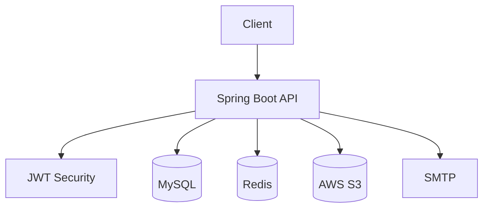

# Kotlin Spring Security Lab
> **한 줄 소개**: 인증/인가, 게시판, 파일 업로드를 통합한 Kotlin + Spring Boot 백엔드 학습 프로젝트

## 1. 프로젝트 개요 (Overview)
- **개발 기간**: 2025년 학습 기간
- **개발 인원**: 개인 프로젝트
- **프로젝트 목적**: Spring Security/JWT 기반 인증 구조와 실무형 부가 기능(S3, 메일, Redis)을 통합 학습
- **Repository**: /Users/dh/Desktop/Code/simple-spring-boot/kotlin_Spring_Security

## 2. 사용 기술 및 선정 이유 (Tech Stack & Decision)

| Category | Tech Stack | Version | Decision Reason (Why?) |
| --- | --- | --- | --- |
| **Language** | Kotlin | 1.9.25 | 도메인/서비스 계층 구현 시 가독성과 null 안전성 확보 |
| **Framework** | Spring Boot + Spring Security + JPA | Boot 3.2.5 | 인증/인가와 데이터 접근 계층을 표준 방식으로 구성하기 위함 |
| **Database** | MySQL | 8.x | 회원/게시글/댓글의 관계형 트랜잭션 처리 목적 |
| **Cache** | Redis | - | 인증 보조 데이터 및 단기 상태 관리 |
| **Infra** | AWS S3, SMTP | - | 파일 업로드와 이메일 인증/알림 시나리오를 포함하기 위함 |

## 3. 시스템 아키텍처 (System Architecture)

- **설계 특징**:
- `member` / `post` / `common` / `aws` 패키지 분리
- JWT 필터와 토큰 프로바이더를 분리해 인증 책임 모듈화
- 예외 핸들러를 도메인/공통으로 분리해 응답 표준화

## 4. 핵심 기능 (Key Features)
- **회원 인증**: JWT 기반 로그인/인가 처리
- **게시판 기능**: 게시글/댓글 CRUD 및 검증 로직
- **파일 업로드**: S3 연동 파일 저장 API 제공
- **운영 보조**: 메일 발송, Swagger 문서화, 테스트 코드 구성

## 5. 트러블 슈팅 및 성능 개선 (Troubleshooting & Refactoring)
### 5-1. 인증 로직 결합도 완화
- **문제(Problem)**: 컨트롤러/서비스에 인증 파싱이 섞이면 변경 시 파급 범위 확대
- **원인(Cause)**: 토큰 해석과 비즈니스 로직이 동일 계층에 섞일 때 테스트/변경 비용 증가
- **해결(Solution)**:
  1. JWT 생성/검증을 `JwtTokenProvider`로 통합
  2. 요청 인증은 `JwtAuthenticationFilter`에서 선처리
- **검증(Verification)**: 인증 정책 변경 시 필터/프로바이더 수정만으로 동작하는지 회귀 테스트
- **결과(Result)**: 인증 변경 시 수정 지점 축소, 기능 코드와 보안 코드의 관심사 분리 개선

### 5-2. 파일 업로드 기능 통합 시 안정성 확보
- **문제(Problem)**: 파일 API를 도입하면 예외 처리와 권한 검증 누락 위험 존재
- **원인(Cause)**: 멀티파트 처리와 저장소 연동 실패 케이스가 일반 API보다 다양함
- **해결(Solution)**:
  1. `S3Service`/`S3Controller` 분리로 업로드 책임 명확화
  2. 공통 예외 처리 계층에서 실패 응답 규격 통일
- **검증(Verification)**: 파일 형식/용량/권한 오류별 응답 코드 및 메시지 일관성 확인
- **결과(Result)**: 업로드 실패 원인 파악이 쉬워지고 API 응답 일관성 향상

## 6. 프로젝트 회고 (Retrospective)
- **배운 점**: 인증/파일/메일 등 주변 기능을 함께 붙여봐야 실제 서비스 구조 감각이 생김
- **아쉬운 점 & 향후 계획**: 운영 환경 기준으로 비밀번호 인코딩 정책, 보안 헤더, 모니터링 지표를 추가 강화할 계획

## 7. API 명세
- API 요약 문서: `/Users/dh/Desktop/Code/simple-spring-boot/kotlin_Spring_Security/docs/API_SPEC.md`
